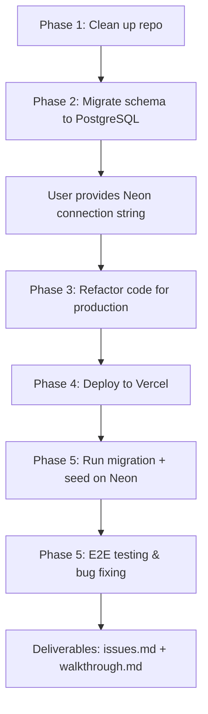

# Migrate Basic Electricity EdTech to Neon PostgreSQL & Deploy to Production

## Background

The **Basic Electricity EdTech** platform is a Next.js 16 application (React 19, Tailwind v4) built for vocational high school students. It currently uses:
- **SQLite** (`file:./dev.db`) as the local database via Prisma
- **Netlify** as the deployment target (via `netlify.toml`)
- **OpenRouter AI** for assessment evaluation and chatbot

The application has 6 core features:
1. **Home** — Animated landing page with formulas and feature cards
2. **Materials** — 7 chapters of hardcoded learning content (client-side)
3. **Simulation Hub** — 6 interactive electrical modules (Ohm's Law, Circuit Safety, Passive/Active Components, Circuit Sandbox, Capacitor Dynamics)
4. **Assessment** — Database-backed chapter quizzes (7 assessments × 4 questions each)
5. **Outcomes** — AI-powered learning evaluation from latest assessment attempt
6. **Chatbot** — Context-aware AI tutor for Basic Electricity topics

**GitHub Repo**: `https://github.com/Abeee89/media-dasar-listrik.git`

---

## User Review Required

> [!IMPORTANT]
> **Neon Database Credentials Needed**: I will need you to provide the Neon PostgreSQL pooled connection string (`postgres://...@ep-xxx.region.aws.neon.tech/dbname?sslmode=require`) after you create the project on [neon.tech](https://neon.tech). I can guide you through the creation process.

> [!IMPORTANT]
> **Deployment Platform**: I'm recommending **Vercel** instead of Netlify for deployment since:
> - Next.js 16 is a Vercel-native framework with first-class support
> - Vercel's serverless functions handle Prisma + connection pooling better
> - Netlify's Next.js adapter has known compatibility issues with newer Next.js versions
> 
> Do you have a Vercel account, or would you prefer to stay with Netlify?

> [!IMPORTANT]
> **NextAuth Secret**: For production, we need a `NEXTAUTH_SECRET`. I'll generate a secure random string for this. You'll need to add it to your deployment environment variables.

## Open Questions

> [!WARNING]
> **File Upload Feature**: The current upload API writes files to the local filesystem (`public/uploads/`). On serverless platforms like Vercel, the filesystem is ephemeral — uploaded files will be lost. Options:
> 1. **Remove the upload feature** for now (simplest)
> 2. **Integrate cloud storage** (e.g., Vercel Blob, Cloudflare R2) — adds complexity
> 3. **Keep it as-is** knowing it won't persist in production
> 
> Which approach do you prefer?

---

## Proposed Changes

### Phase 1: Repository Consolidation & Architecture Cleanup

The codebase is already a well-structured Next.js monolith (not separate frontend/backend repos), so major restructuring isn't needed. However, several cleanup items are required:

#### [MODIFY] [.env.example](file:///c:/Semester/Metopen/Dasar%20Listrik/.env.example)
- Add `NEXTAUTH_SECRET` variable
- Update `DATABASE_URL` comment to indicate Neon pooled connection string format
- Add `DIRECT_URL` for Prisma migrations (non-pooled connection)

#### [MODIFY] [.gitignore](file:///c:/Semester/Metopen/Dasar%20Listrik/.gitignore)
- Fix corrupted UTF-16 bytes at end of file (lines 48-50)
- Add `prisma/dev.db` to prevent committing the SQLite file

#### [DELETE] `prisma/dev.db`
- Remove the local SQLite database file from the repo

---

### Phase 2: Database Migration — SQLite → Neon PostgreSQL

#### [MODIFY] [schema.prisma](file:///c:/Semester/Metopen/Dasar%20Listrik/prisma/schema.prisma)

Key changes:
```diff
 datasource db {
-  provider = "sqlite"
-  url      = env("DATABASE_URL")
+  provider  = "postgresql"
+  url       = env("DATABASE_URL")
+  directUrl = env("DIRECT_URL")
 }
```

Additional schema improvements for PostgreSQL:
- Add `@db.Text` annotation to long text fields (`content`, `feedback`, `options`, `objectives`) since PostgreSQL distinguishes `VARCHAR(191)` from `TEXT`
- Add `@@index` for frequently queried foreign keys (`userId`, `assessmentId`, `moduleId`) to optimize JOIN performance
- Add `createdAt`/`updatedAt` timestamps to tables missing them (`Progress`, `Module`, `Material`)

#### [MODIFY] [seed.ts](file:///c:/Semester/Metopen/Dasar%20Listrik/prisma/seed.ts)
- Use `upsert` instead of delete-then-create pattern (safer for PostgreSQL with FK constraints)
- Also seed the `Module` and `Material` tables from the hardcoded data in `materials/page.tsx` to make the materials page database-driven

#### [MODIFY] [prisma.ts](file:///c:/Semester/Metopen/Dasar%20Listrik/src/lib/prisma.ts)
- Add connection pool configuration for Neon's serverless driver
- Add `log` configuration for debugging connection issues

---

### Phase 3: Application Code Refactoring

#### [MODIFY] [assessment/page.tsx](file:///c:/Semester/Metopen/Dasar%20Listrik/src/app/assessment/page.tsx)
- Remove the unused `import { motion } from "framer-motion"` (it's a Server Component — framer-motion is a client library)

#### [MODIFY] [api/assessment/submit/route.ts](file:///c:/Semester/Metopen/Dasar%20Listrik/src/app/api/assessment/submit/route.ts)
- Add request body size validation (prevent excessively large payloads)
- Add rate limiting consideration comment

#### [MODIFY] [api/upload/route.ts](file:///c:/Semester/Metopen/Dasar%20Listrik/src/app/api/upload/route.ts)
- Based on user's decision about file uploads (see Open Questions)

#### [MODIFY] [next.config.ts](file:///c:/Semester/Metopen/Dasar%20Listrik/next.config.ts)
- Add `serverExternalPackages: ["@prisma/client"]` for proper Prisma bundling in serverless

---

### Phase 4: Production Deployment Configuration

#### [NEW] `vercel.json`
- Configure build command, environment variables injection hints
- Set proper function regions close to Neon database region

#### [MODIFY] [package.json](file:///c:/Semester/Metopen/Dasar%20Listrik/package.json)
- Add `postinstall` script: `prisma generate` (required for Vercel builds)
- Update `build` script if needed

#### Environment Variables for Vercel:
| Variable | Description |
|---|---|
| `DATABASE_URL` | Neon **pooled** connection string (`-pooler` suffix) |
| `DIRECT_URL` | Neon **direct** connection string (for migrations) |
| `NEXTAUTH_SECRET` | Random 32+ char string |
| `NEXTAUTH_URL` | Production URL (auto-set by Vercel) |
| `OPENROUTER_API_KEY` | Existing API key |

---

### Phase 5: Post-Deployment E2E Testing & Issue Resolution

#### [NEW] `issues.md`
Testing matrix to execute and document:

| Test Category | What to Test |
|---|---|
| **Connection Stability** | Neon cold-start after idle (auto-suspend), connection timeout handling |
| **Data Integrity** | Empty form submission, duplicate unique keys, excessively long strings (>10K chars), SQL injection attempts |
| **Auth Flow** | Register → Login → Protected routes, session expiry, invalid credentials |
| **Assessment Flow** | Full quiz submission, partial answers (nulls), re-submission, AI evaluation generation |
| **API Robustness** | Invalid JSON body, missing fields, unauthorized access, rate limiting |
| **Latency** | API response times under Neon free tier cold starts |

Each discovered issue will be documented in the format:
```markdown
### [ISSUE-XX]: Description
- **Cause:** Root technical cause
- **Evaluation:** User experience / stability impact
- **Resolution:** Code fix applied
```

---

## Verification Plan

### Automated Tests
1. **Build verification**: `npm run build` completes without errors
2. **Prisma migration**: `npx prisma migrate deploy` succeeds against Neon
3. **Seed verification**: `npx prisma db seed` populates all 7 assessments + questions
4. **Browser E2E tests**: Using the browser subagent tool to:
   - Navigate all pages and verify rendering
   - Complete a full registration → login → assessment → outcomes flow
   - Test edge cases (empty submissions, long inputs, rapid submissions)
   - Verify chatbot responds correctly

### Manual Verification
1. **Live URL**: Confirm the deployed Vercel URL loads and all features work
2. **Database verification**: Check Neon dashboard shows correct tables and data
3. **Cold start test**: Wait for Neon to auto-suspend (~5 min idle), then hit the app and verify graceful reconnection

---

## Execution Order


