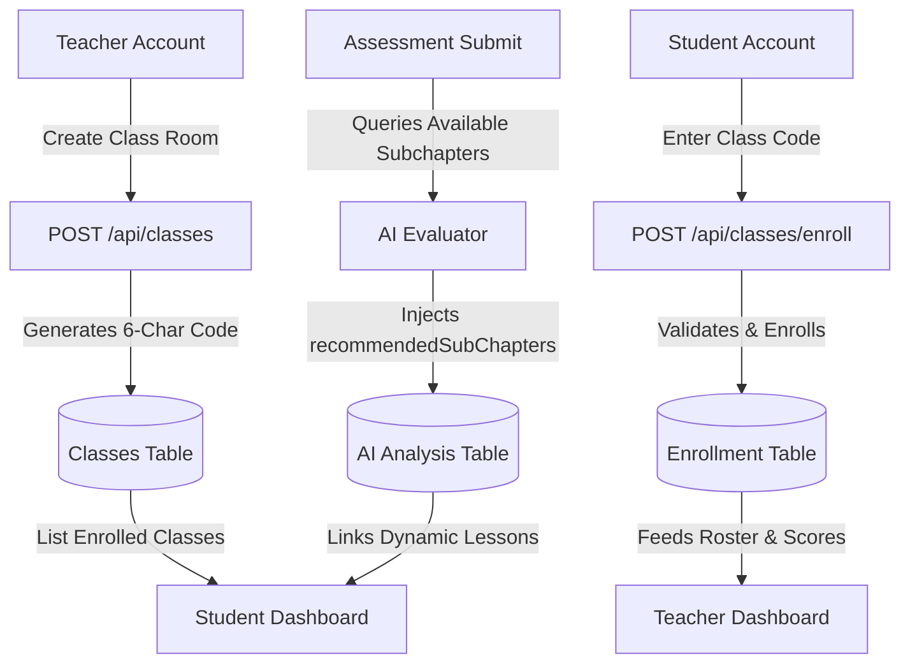

# Phase 3 Walkthrough: Teacher & Student separation

Phase 3 introduces role-aware workflows separating **Student** and **Teacher** views. It enables teachers to create class sections and trace grades, allows students to enroll in classes using a 6-character code, updates the subchapter reading interface, and integrates AI outcome recommendations with DB-backed material nodes.

---

## 1. Accomplishments & Architecture



### Key Modules Implemented

1. **Teacher Dashboard (`/dashboard/teacher`)**
   - **Metrics Bar**: Tracks class count, enrolled student count, and global average score.
   - **Roster & Performance Tables**: Lists enrolled students, when they joined, quiz count, and average score.
   - **Class Room Creator**: Auto-generates unique 6-character codes (e.g., `5W9M3Q`).
   - **Copy-to-Clipboard Widget**: Smooth click-to-copy with confirmation checkmarks.
   - **Recent Activity Feed**: Traces recent attempts, scores, and completion timestamps in real time.

2. **Student Dashboard Class Enrollment (`/dashboard/student`)**
   - **Join Class Room widget**: Fast, interactive sidebar widget accepting 6-char codes and showing instant feedback.
   - **My Class Rooms grid**: Lists joined classes and teacher details.
   - **Router Refresh**: Instant updates without page reloads.

3. **Sub-Chapter Reader View (`/materials/[chapterId]/[subChapterId]`)**
   - **Left Sidebar Outline**: Sticky outline list of sibling subchapter lessons for swift navigation.
   - **Lesson Frame**: Render objectives, content body, and bibliographic citations.
   - **Smart Navigation Footer**: Includes "Previous Lesson", "Next Lesson", or a "Take Chapter Assessment" CTA if it's the last subchapter of the chapter.

4. **Dynamic AI Sub-Chapter Recommendations**
   - **Schema Realignment**: Upgraded API evaluator to accept all subchapters in context.
   - **AI Analysis Parsing**: Instructs the model to output a `recommendedSubChapters` CUID array based on mistakes.
   - **Dashboard Routing**: Renders matched database nodes with clickable links on the Student Dashboard.

---

## 2. File Artifacts Created & Modified

### New Files Created
- [`/src/app/materials/[chapterId]/[subChapterId]/page.tsx`](file:///c:/Semester/Metopen/v1-DasarListrik/src/app/materials/[chapterId]/[subChapterId]/page.tsx) — Dynamic curriculum reader with navigation panels.
- [`/src/app/api/classes/route.ts`](file:///c:/Semester/Metopen/v1-DasarListrik/src/app/api/classes/route.ts) — Teacher endpoint to create class rooms.
- [`/src/app/api/classes/enroll/route.ts`](file:///c:/Semester/Metopen/v1-DasarListrik/src/app/api/classes/enroll/route.ts) — Student endpoint to register class codes.
- [`/src/app/dashboard/teacher/TeacherDashboardClient.tsx`](file:///c:/Semester/Metopen/v1-DasarListrik/src/app/dashboard/teacher/TeacherDashboardClient.tsx) — Analytics interface for class grades.
- [`/src/app/dashboard/student/JoinClassForm.tsx`](file:///c:/Semester/Metopen/v1-DasarListrik/src/app/dashboard/student/JoinClassForm.tsx) — Client component handling class join codes.

### Existing Files Modified
- [`/src/app/dashboard/teacher/page.tsx`](file:///c:/Semester/Metopen/v1-DasarListrik/src/app/dashboard/teacher/page.tsx) — Queries and serializes DB classes/outcomes.
- [`/src/app/dashboard/student/page.tsx`](file:///c:/Semester/Metopen/v1-DasarListrik/src/app/dashboard/student/page.tsx) — Embeds class lists, enrollment forms, and AI recommended lesson link blocks.
- [`/src/lib/outcomes/evaluator.ts`](file:///c:/Semester/Metopen/v1-DasarListrik/src/lib/outcomes/evaluator.ts) — Integrates `recommendedSubChapters` into JSON instruction mapping.
- [`/src/app/api/assessment/submit/route.ts`](file:///c:/Semester/Metopen/v1-DasarListrik/src/app/api/assessment/submit/route.ts) — Gathers all subchapters and feeds them to the evaluator.

---

## 3. Compilation Verification

Running the TypeScript compiler check:
```bash
npx tsc --noEmit
```
**Status**: `SUCCESS` (Completed with `0` errors).

---

## 4. Next Phase Action Steps

With Phase 3 complete and verified, we are ready to proceed to Phase 4 (Simulations integration) or Phase 5 (Review and Polish) upon your confirmation.
