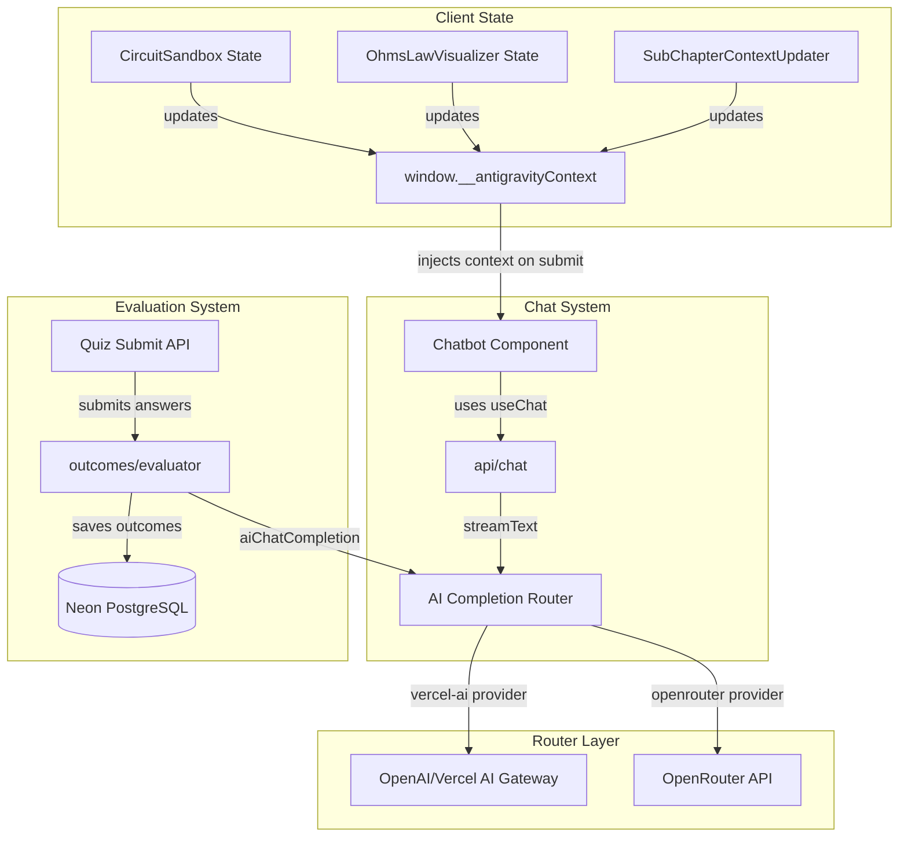

# Phase 5 Walkthrough: Adaptive AI Engine & Real-Time Copilot

This phase completes the Next.js LMS platform redesign, implementing a **Dual-Model AI Engine**, **Enhanced AI Evaluation** with subchapter recommendations, and a **Context-Aware Streaming Chatbot (Antigravity Copilot)** integrated with interactive simulation sandbox states.

---

## 1. Architectural Blueprint

The unified AI ecosystem connects database materials, live student submissions, simulator telemetry, and AI models through a robust abstraction layer:



---

## 2. Implemented Components & Core Logic

### A. Dual-Model AI Engine (`src/lib/ai.ts`)
Introduces a unified abstraction layer supporting both Vercel AI SDK (with support for OpenAI, Vercel AI Gateway, and customizable model sizes) and OpenRouter fallback:
- **`aiChatCompletion`**: Decouples completion logic from routing; reads `AI_PROVIDER` (`vercel-ai` or `openrouter`) and resolves appropriately.
- **Failover Security**: If Vercel AI Gateway fails or credentials are unset, automatically falls back to OpenRouter to ensure learning materials remain fully interactive.

### B. Context-Aware Evaluation & Subchapter Recommendations (`src/lib/outcomes/evaluator.ts`)
Provides precise, database-driven diagnostic outcomes:
- **Recommendation Logic**: Evaluator accepts all available subchapters and maps student weak points to actual subchapters in the DB, returning a list of `recommendedSubChapters`.
- **Enriched Submission Context**: Quiz submissions query chapter titles and subchapter objectives dynamically, formatting them for the evaluator prompt.

### C. Floating AI Copilot with Real-Time Simulator Telemetry (`src/app/api/chat/route.ts`, `src/components/layout/Chatbot.tsx`)
A seamless, real-time assistant:
- **`useChat` Integration**: Migrated chatbot to Vercel AI SDK for native token-by-token streaming.
- **Dynamic Context Updater**: Server components render `SubChapterContextUpdater` to populate `window.__antigravityContext`.
- **Sandbox Integration**: The Ohm's Law and Circuit Sandbox components update `window.__antigravityContext` dynamically when values (Voltage, Resistance, short-circuits) change, sending live circuit telemetry on chat submit.

---

## 3. How to Validate & Run the Platform

### A. Programmatic Validation
A custom validation suite has been created at `scripts/validate-platform.ts` to test all capabilities in isolation:
1. **DB Integrity Check**: Validates database queries against schema tables.
2. **Router API Call Check**: Connects to the AI router to verify completing.
3. **Outcomes Engine Check**: Executes evaluation with incorrect answers, verifying `recommendedSubChapters` generation.

To run:
```bash
npx tsx scripts/validate-platform.ts
```

### B. Build and Start the Application
To build the production Bundle:
```bash
npm run build
```
To run the local Next.js development server:
```bash
npm run dev
```
Open [http://localhost:3000](http://localhost:3000) to view the redesigned, full-stack educational platform.
